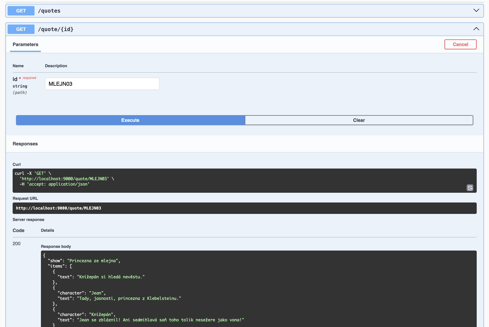

# Fairy Quotes

Projekt je vystavěn na NodeJS verzi 22.14.0 a zahrnuje následující části:

- Quote-lib - sdílená knihovna obsahující číselník hlášek
- Frontend - NextJS aplikace využívající Quote-lib
- Backend - NestJS aplikace využívající Quote-lib

Frontend i Backend aplikace jsou v podstatě jen předělané defaultní templaty.

## Instalace

Stačí pouze nainstalovat závislosti jednotlivých částí:

```sh
(cd quote-lib && npm install)
(cd frontend && npm install)
(cd backend && npm install)
```

## Quote-lib

Sdílená knihovna s číselníkem hlášek.

Pro rozjetí dev verze:

```sh
(cd quote-lib && npm run dev)
```

Složka `src` obsahuje zdrojové soubory, `lib` pak zkompilované. Pro přidávání dalších hlašek stačí editovat soubor `src/quotes.ts` a rekompilovat.

Obsahuje jediný test (`src/quotes.spec.ts`), který lze vyvolat pomocí:

```sh
(cd quote-lib && npm run test)
```

Pro coverage report:

```sh
(cd quote-lib && npm run coverage)
```

Linting je dostupný skrze:

```sh
(cd quote-lib && npm run lint)
```

Formátování pomocí Prettieru pak:

```sh
(cd quote-lib && npm run format)
```

## Frontend


Aplikaci je možné rozběhnout pro development pomocí (nejprvé je však nutné rozběhnout Quote-lib dev):

```sh
(cd frontend && npm run dev)
```

Výchozí port je 8080, web by tedy měl být dostupný na [http://localhost:8080](http://localhost:8080).

Linting je dostupný skrze:

```sh
(cd frontend && npm run lint)
```

Formátování pomocí Prettieru pak:

```sh
(cd frontend && npm run format)
```

## Backend



BE je obdobně jako FE možné pro dev rozjet pomocí (stejně tak je nejprvé nutné rozběhnout Quote-lib dev):

```sh
(cd backend && npm run dev)
```

Defaultně by měla být dostupná na portu 3000.
API obsahuje dva endpointy:

- `GET http://localhost:9000/quotes` - Slouží pro získání identifikátorů z číselníku hlášek.
- `GET http://localhost:9000/quote/:id` - Slouží pro ziskání konkrátní hlášky (dialogu hlášek) pro zvolené id (404 v případě nenalezeného záznamu).

Více info viz Swagger dokumentace: [http://localhost:9000/docs](http://localhost:9000/docs).

Linting je dostupný skrze:

```sh
(cd backend && npm run lint)
```

Formátování pomocí Prettieru pak:

```sh
(cd backend && npm run format)
```

## Troubleshooting

### Module not found `@quote-lib/main`

Může se stát jak u Frontendu, tak i Backendu. Důvodem je nejpravděpodobněji nějaká nekonzistence v `lib` souborech Quote-lib.
Řešením smazat `tsconfig.tsbuildinfo` a znovu spustit dev verzi ve Quote-lib.

## Do budoucna

Aneb co by se dalo vylepšit nad rámec práce:

- Sjednocení a vylepšení Eslint (a Prettier) configurace
- Doplnit testy pro Backend a Frontend
- Vytvořit flow pro deployment (zatím vše jen v `dev` režimu)
- Využít API z Backendu pro Frontend
- Promazat nevyužité soubory z defaultních templatů
- Přesunout test v Quote-lib do samostatného adresáře, aby nebyl kompilován do `lib`.
